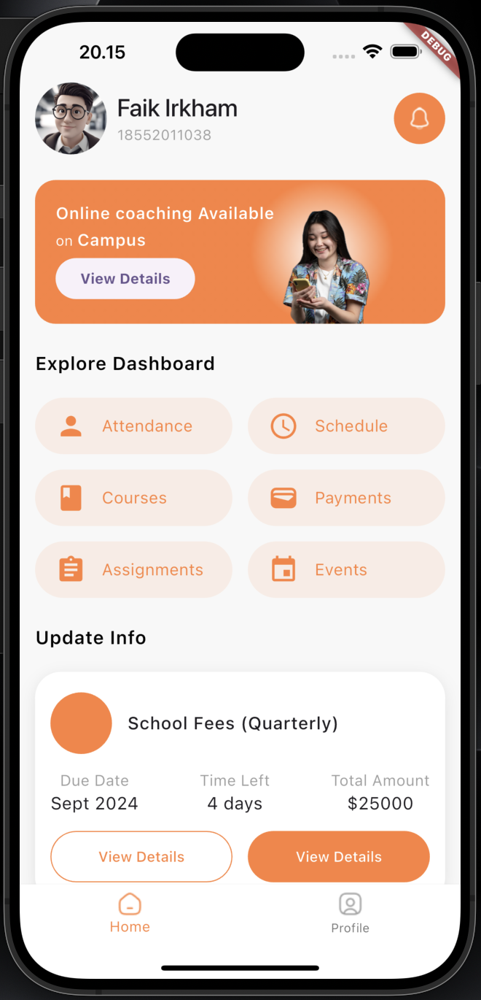
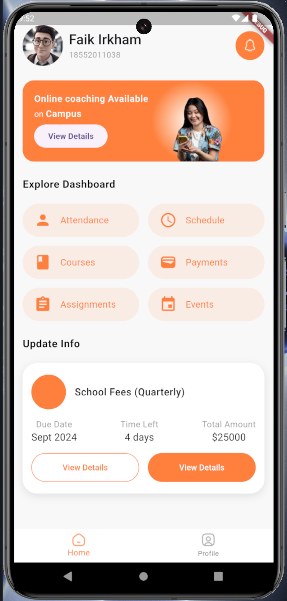

# Edu App Flutter UI

  
  

Edu App Flutter UI adalah aplikasi antarmuka pengguna yang dikembangkan menggunakan Flutter. Aplikasi ini dirancang untuk keperluan pendidikan, menghadirkan berbagai fitur seperti dashboard, jadwal kelas, informasi mata pelajaran, dan interaksi antara siswa serta guru dalam tampilan modern dan responsif.

Fitur Utama

- Dashboard: Tampilkan informasi penting seperti jadwal kelas, pengumuman terbaru, dan ringkasan aktivitas belajar.
- Jadwal Kelas: Kelola dan lihat jadwal kelas harian dengan antarmuka yang mudah dipahami.
- Profil Pengguna: Halaman profil untuk siswa dan guru dengan detail informasi dan pengaturan akun.
  Interaksi Guru dan Siswa: Fitur untuk komunikasi antara guru dan siswa.
- Tampilan Responsif: Desain UI yang responsif dan kompatibel dengan berbagai ukuran layar.

# Edu App Flutter UI

Edu App Flutter UI adalah aplikasi antarmuka pengguna yang dikembangkan menggunakan Flutter. Aplikasi ini dirancang untuk keperluan pendidikan, menghadirkan berbagai fitur seperti dashboard, jadwal kelas, informasi mata pelajaran, dan interaksi antara siswa serta guru dalam tampilan modern dan responsif.

Fitur Utama

- Dashboard: Tampilkan informasi penting seperti jadwal kelas, pengumuman terbaru, dan ringkasan aktivitas belajar.
- Jadwal Kelas: Kelola dan lihat jadwal kelas harian dengan antarmuka yang mudah dipahami.
- Profil Pengguna: Halaman profil untuk siswa dan guru dengan detail informasi dan pengaturan akun.
  Interaksi Guru dan Siswa: Fitur untuk komunikasi antara guru dan siswa.
- Tampilan Responsif: Desain UI yang responsif dan kompatibel dengan berbagai ukuran layar.

## Credit

UI by: [EduGO - Student App UX Case Study](https://www.behance.net/gallery/204605945/EduGO-Student-App-UX-Case-Study)
